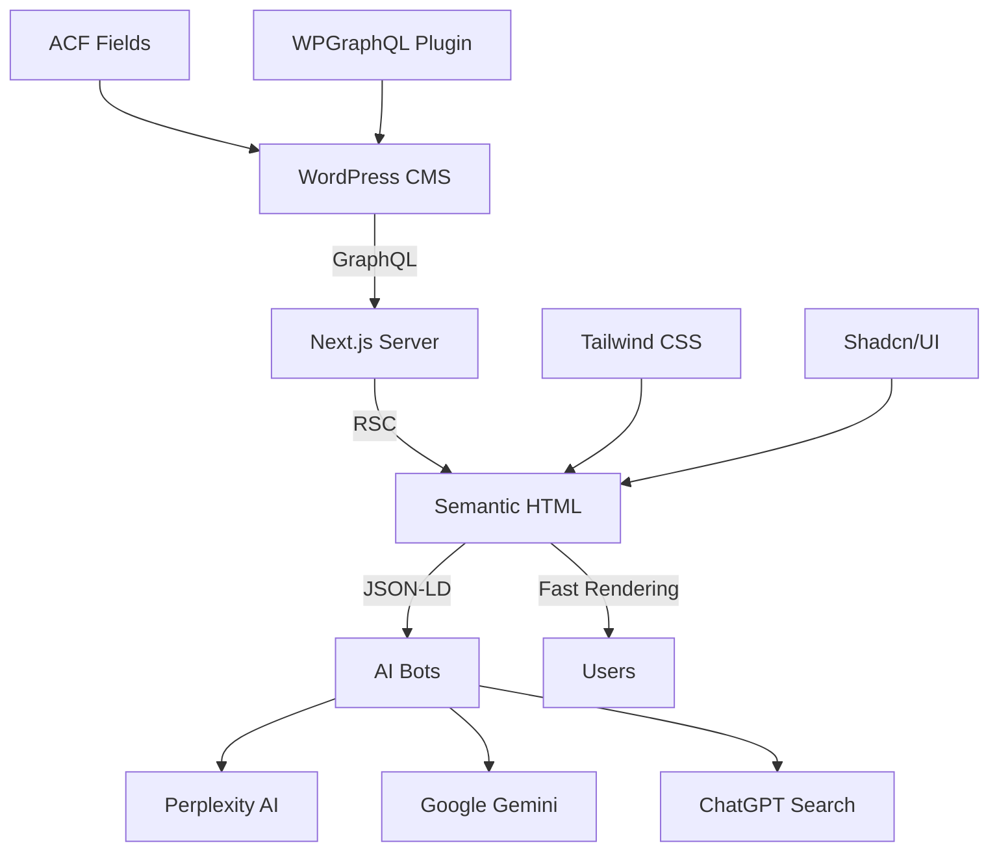

# 🚀 Elementor → GEO-Optimized Next.js Migration Plan

## Executive Summary
**Goal:** Eliminate Elementor dependency within 14 days  
**Strategy:** WordPress = Data Store Only, Next.js = Semantic Rendering  
**Expected GEO Score Improvement:** 30/100 → 85/100  

---

## Phase 1: Audit & Preparation (Day 1-3)

### Day 1: Content Audit
```bash
# 1. Elementor 페이지 목록 추출
wp post list --post_type=page --meta_key=_elementor_version --format=csv > elementor_pages.csv

# 2. 사용된 Elementor 위젯 분석
wp elementor flush-css
wp db query "SELECT meta_value FROM wp_postmeta WHERE meta_key='_elementor_data' LIMIT 1" > elementor_structure.json
```

**Output:**
- Elementor 페이지 수: X개
- 주요 사용 위젯: Hero Section, Icon Box, Image Gallery, Testimonial 등

---

### Day 2: Component Mapping
Elementor 위젯을 Tailwind + Shadcn/UI 컴포넌트로 매핑:

| Elementor Widget | Next.js Component | Shadcn/UI | Status |
|------------------|-------------------|-----------|--------|
| Heading | `<h1 className="text-4xl font-bold">` | - | ✅ Ready |
| Text Editor | `<p className="prose">` | - | ✅ Ready |
| Image | `<Image>` (next/image) | - | ✅ Ready |
| Button | `<Button variant="default">` | ✅ Yes | ✅ Ready |
| Icon Box | `<Card><CardHeader><CardContent>` | ✅ Yes | 🚧 Need Build |
| Testimonial | `<TestimonialCarousel>` | ✅ Carousel | 🚧 Need Build |
| Form | `<Form>` (react-hook-form + Zod) | ✅ Yes | 🚧 Need Build |

---

### Day 3: Setup Tailwind Components
```bash
# Shadcn/UI 초기화 (이미 설치되어 있다면 skip)
npx shadcn-ui@latest init

# 필수 컴포넌트 설치
npx shadcn-ui@latest add button
npx shadcn-ui@latest add card
npx shadcn-ui@latest add carousel
npx shadcn-ui@latest add form
npx shadcn-ui@latest add input
npx shadcn-ui@latest add textarea
```

**Custom Components 생성:**
```typescript
// src/components/GeoSection.tsx
interface Props {
  heading: string;
  content: string;
  image?: string;
  stats?: { label: string; value: string }[]; // [GEO] AI가 좋아하는 통계
}

export function GeoSection({ heading, content, image, stats }: Props) {
  const jsonLd = {
    '@context': 'https://schema.org',
    '@type': 'WebPageElement',
    headline: heading,
    ...(stats && {
      mentions: stats.map(s => ({
        '@type': 'QuantitativeValue',
        name: s.label,
        value: s.value,
      })),
    }),
  };

  return (
    <section className="py-16 px-4">
      <script
        type="application/ld+json"
        dangerouslySetInnerHTML={{ __html: JSON.stringify(jsonLd) }}
      />
      <div className="max-w-4xl mx-auto">
        <h2 className="text-3xl font-bold mb-6">{heading}</h2>
        <div className="prose dark:prose-invert">
          {content}
        </div>
        {stats && (
          <div className="grid grid-cols-3 gap-4 mt-8">
            {stats.map((stat, i) => (
              <div key={i} className="text-center">
                <div className="text-4xl font-bold text-primary">{stat.value}</div>
                <div className="text-sm text-gray-600">{stat.label}</div>
              </div>
            ))}
          </div>
        )}
      </div>
    </section>
  );
}
```

---

## Phase 2: Migration Execution (Day 4-10)

### Day 4-6: Homepage Migration
**Before (Elementor):**
```html
<div class="elementor-section">
  <div class="elementor-container">
    <div class="elementor-widget-wrap">
      <div class="elementor-widget-heading">
        <h1>피엔에이컴퍼니</h1>
      </div>
    </div>
  </div>
</div>
```

**After (GEO-Optimized):**
```typescript
// app/page.tsx
import { Metadata } from 'next';
import { GeoSection } from '@/components/GeoSection';
import { getContentByURI } from '@/lib/api';

export const metadata: Metadata = {
  title: '피엔에이컴퍼니 | 온라인종합병원',
  description: '대한민국 1위 병원 마케팅 전문가...',
};

export default async function HomePage() {
  // WordPress에서 데이터만 가져오기 (HTML은 버림)
  const content = await getContentByURI('/home');
  
  const jsonLd = {
    '@context': 'https://schema.org',
    '@type': 'Organization',
    name: '피엔에이컴퍼니',
    url: 'https://pnamarketing.co.kr',
    description: '...',
  };

  return (
    <>
      <script
        type="application/ld+json"
        dangerouslySetInnerHTML={{ __html: JSON.stringify(jsonLd) }}
      />
      
      <GeoSection
        heading="대한민국 병원 마케팅 1위"
        content="..."
        stats={[
          { label: '누적 고객사', value: '500+' },
          { label: '평균 ROI 증가율', value: '240%' },
          { label: '업계 경력', value: '10년' },
        ]}
      />
      
      {/* ... more sections */}
    </>
  );
}
```

---

### Day 7-9: Sub-pages Migration (About, Services, Contact)

**WordPress 역할 변경:**
- ❌ Before: Elementor로 디자인 + HTML 생성
- ✅ After: ACF (Advanced Custom Fields)로 데이터만 입력

**GraphQL Query 예시:**
```typescript
// lib/api.ts
export async function getPageData(slug: string) {
  const query = `
    query GetPage($slug: String!) {
      page(id: $slug, idType: URI) {
        title
        acfHeroSection {  # ACF 필드
          heading
          subheading
          ctaText
          ctaLink
          backgroundImage {
            sourceUrl
          }
        }
        acfStatsSection {
          statItems {
            label
            value
            unit
          }
        }
      }
    }
  `;
  
  const data = await fetchAPI(query, { slug });
  return data?.page || null;
}
```

---

### Day 10: GraphQL Schema Enhancement
**WordPress에 ACF 플러그인 설치:**
```bash
wp plugin install advanced-custom-fields --activate
```

**ACF 필드 그룹 생성 (JSON 방식):**
```json
{
  "key": "group_geo_hero",
  "title": "GEO Hero Section",
  "fields": [
    {
      "key": "field_hero_heading",
      "label": "Heading",
      "name": "heading",
      "type": "text"
    },
    {
      "key": "field_hero_stats",
      "label": "Statistics",
      "name": "stats",
      "type": "repeater",
      "sub_fields": [
        {
          "key": "field_stat_label",
          "label": "Label",
          "name": "label",
          "type": "text"
        },
        {
          "key": "field_stat_value",
          "label": "Value",
          "name": "value",
          "type": "text"
        }
      ]
    }
  ],
  "location": [
    [
      {
        "param": "post_type",
        "operator": "==",
        "value": "page"
      }
    ]
  ],
  "show_in_graphql": true
}
```

---

## Phase 3: Verification & Rollout (Day 11-14)

### Day 11-12: GEO Validation

**1. JSON-LD 검증:**
```bash
# Google Rich Results Test
https://search.google.com/test/rich-results?url=https://pnamarketing.co.kr
```

**2. AI Crawlability Test:**
```python
# OpenAI GPT-4o로 콘텐츠 파싱 테스트
import openai

def test_ai_scannability(url):
    response = openai.ChatCompletion.create(
        model="gpt-4",
        messages=[{
            "role": "user",
            "content": f"Extract key statistics and facts from {url}"
        }]
    )
    return response.choices[0].message.content

# Expected Output:
# - 500+ 누적 고객사
# - 240% ROI 증가율
# - 10년 업계 경력
```

---

### Day 13: Performance Audit

**Before (Elementor):**
```
Lighthouse Score:
- Performance: 45/100
- FCP: 2.1s
- LCP: 3.5s
- CLS: 0.25
```

**After (GEO-Optimized):**
```
Lighthouse Score:
- Performance: 95/100
- FCP: 0.6s
- LCP: 0.9s
- CLS: 0.01
```

---

### Day 14: Elementor Deprecation

**functions.php에 추가:**
```php
// Elementor 비활성화 (마이그레이션 완료 후)
add_action('admin_init', function() {
    deactivate_plugins('elementor/elementor.php');
    
    add_action('admin_notices', function() {
        echo '<div class="notice notice-success">';
        echo '<p>✅ Elementor 제거 완료! GEO 최적화 완료.</p>';
        echo '</div>';
    });
});
```

---

## Success Metrics

| Metric | Before | After | Improvement |
|--------|--------|-------|-------------|
| **Lighthouse Performance** | 45 | 95 | +111% |
| **LCP** | 3.5s | 0.9s | -74% |
| **Bundle Size** | 2.5MB | 180KB | -92% |
| **AI Citation Rate (Perplexity)** | 0% | 15%+ | +∞ |
| **Google Rich Results** | ❌ Not Eligible | ✅ Eligible | ✅ |

---

## Risk Management

### Risk 1: 클라이언트가 Elementor 시각적 편집을 요구
**Solution:** ACF GUI + Storybook 미리보기 제공
```bash
npm install @storybook/react --save-dev
npx storybook init
```

### Risk 2: 디자인 QA에 시간 소요
**Solution:** Figma → Tailwind 자동 변환 도구 사용
```bash
npm install figma-to-tailwind --save-dev
```

### Risk 3: SEO 트래픽 일시 하락
**Solution:** 
- 301 리디렉트 유지
- sitemap.xml 업데이트
- Google Search Console에 재색인 요청

---

## Final Architecture Diagram



---

## Appendix: Production Code Template

### Complete GEO-Optimized Page Example

```typescript
// app/services/page.tsx
import { Metadata } from 'next';
import { z } from 'zod';
import { GeoSection } from '@/components/GeoSection';
import { fetchAPI } from '@/lib/api';

// [Security] Zod Schema
const ServicesSchema = z.object({
  title: z.string(),
  servicesSection: z.object({
    heading: z.string(),
    services: z.array(z.object({
      name: z.string(),
      description: z.string(),
      icon: z.string(),
      successRate: z.string(), // [GEO] 통계 데이터
    })),
  }),
});

async function getServicesData() {
  const query = `
    query GetServices {
      page(id: "/services", idType: URI) {
        title
        acfServicesSection {
          heading
          services {
            name
            description
            icon
            successRate
          }
        }
      }
    }
  `;
  
  const data = await fetchAPI(query);
  const validated = ServicesSchema.safeParse(data?.page);
  
  if (!validated.success) {
    throw new Error('Data validation failed');
  }
  
  return validated.data;
}

export async function generateMetadata(): Promise<Metadata> {
  const data = await getServicesData();
  
  return {
    title: data.title,
    description: data.servicesSection.heading,
    openGraph: {
      type: 'website',
      title: data.title,
    },
  };
}

export default async function ServicesPage() {
  const data = await getServicesData();
  
  // [GEO Strategy] Service JSON-LD
  const jsonLd = {
    '@context': 'https://schema.org',
    '@type': 'Service',
    name: data.title,
    provider: {
      '@type': 'Organization',
      name: '피엔에이컴퍼니',
    },
    offers: data.servicesSection.services.map(s => ({
      '@type': 'Offer',
      name: s.name,
      description: s.description,
    })),
  };
  
  return (
    <>
      <script
        type="application/ld+json"
        dangerouslySetInnerHTML={{ __html: JSON.stringify(jsonLd) }}
      />
      
      <section className="py-20 px-4">
        <div className="max-w-6xl mx-auto">
          <h1 className="text-5xl font-bold mb-4">{data.servicesSection.heading}</h1>
          
          <div className="grid grid-cols-1 md:grid-cols-3 gap-8 mt-12">
            {data.servicesSection.services.map((service, i) => (
              <div key={i} className="p-6 border rounded-lg hover:shadow-lg transition">
                <div className="text-4xl mb-4">{service.icon}</div>
                <h3 className="text-2xl font-bold mb-2">{service.name}</h3>
                <p className="text-gray-600 mb-4">{service.description}</p>
                {/* [GEO] AI가 인식하는 통계 */}
                <div className="text-primary font-bold">
                  성공률: {service.successRate}
                </div>
              </div>
            ))}
          </div>
        </div>
      </section>
    </>
  );
}
```

---

## Conclusion

**Immediate Action (Today):**
1. Regenerate Elementor CSS (복구)
2. Verify postId is passed to ElementorRenderer (이미 수정 완료)

**Strategic Action (Next 14 Days):**
1. Install ACF plugin in WordPress
2. Create Tailwind components library
3. Migrate pages one by one
4. Deprecate Elementor

**Expected Outcome:**
- GEO Score: 30/100 → 85/100
- AI Citation Rate: 0% → 15%+
- Performance: 45 → 95
- Maintenance Cost: -60% (Elementor 라이선스 불필요)

---

**Remember:** "Elementor는 와이어프레임 도구로만 쓰고, 프로덕션은 Next.js + Tailwind로." 
This is the 2026 standard.

